learn-ai/
│
├── README.md                   # Project overview, usage, learning path
├── LICENSE
│
├── framework/                  # Reusable shared AI code
│   ├── matrix.h / .cpp
│   ├── vector.h / .cpp
│   ├── activations.h / .cpp
│   ├── loss.h / .cpp
│   ├── optimizer.h / .cpp
│   ├── layer.h / .cpp
│   ├── rnn_layer.h / .cpp
│   ├── transformer_layer.h / .cpp
│   └── ...
│
├── lessons/                    # Step-by-step learning modules
│   ├── 01_math_basics/
│   │   ├── vector_lesson.cpp
│   │   ├── matrix_lesson.cpp
│   │   └── README.md  # Explains the step and promotes to framework
│   ├── 02_activations/
│   ├── 03_loss_functions/
│   ├── 04_optimizers/
│   ├── 05_neural_networks/
│   └── ...
│
├── examples/                   # Full AI programs built with the framework
│   ├── mlp_classification.cpp
│   ├── rnn_textgen.cpp
│   ├── transformer_textgen.cpp
│   └── README.md
│
├── data/                       # Datasets like tiny Shakespeare, MNIST
│   ├── tiny_shakespeare.txt
│   └── ...
│
├── scripts/                    # Build/run helpers
│   ├── build.sh
│   └── run_examples.sh
│
└── docs/
    ├── timeline.md
    ├── matrix_math.md
    ├── neural_nets.md
    └── ...

UML DIAGRAMS:

CURRENT:

```mermaid
classDiagram
    %% Tensor: Enhanced for C++ with operations and gradient support
    class Tensor {
        <<data structure>>
        -shape: std::vector~int~
        -data: float*
        -gradient: Tensor*
        -requires_grad: bool
        +Tensor()
        +Tensor(shape: std::vector~int~)
        +~Tensor()
        +add(other: Tensor&): Tensor*
        +multiply(other: Tensor&): Tensor*
        +matmul(other: Tensor&): Tensor*
        +zero_grad(): void
    }

    %% Dataset: Simple interface for data handling
    class Dataset {
        <<interface>>
        +nextBatch(batchSize: int): Tensor*
        +~Dataset()
    }
    class SimpleDataset {
        +nextBatch(batchSize: int): Tensor*
        +~SimpleDataset()
    }

    %% Initializer: For weight initialization
    class Initializer {
        <<interface>>
        +initialize(rows: int, cols: int): Tensor*
        +~Initializer()
    }
    class HeInitializer {
        +initialize(rows: int, cols: int): Tensor*
        +~HeInitializer()
    }

    %% LossFunction: For computing loss
    class LossFunction {
        <<interface>>
        +compute(prediction: Tensor&, target: Tensor&): float
        +derivative(prediction: Tensor&, target: Tensor&): Tensor*
        +~LossFunction()
    }
    class MSELoss {
        +compute(prediction: Tensor&, target: Tensor&): float
        +derivative(prediction: Tensor&, target: Tensor&): Tensor*
        +~MSELoss()
    }
    class CrossEntropyLoss {
        +compute(prediction: Tensor&, target: Tensor&): float
        +derivative(prediction: Tensor&, target: Tensor&): Tensor*
        +~CrossEntropyLoss()
    }

    %% Optimizer: For updating weights
    class Optimizer {
        <<interface>>
        +update(weights: Tensor&, gradients: Tensor&): void
        +~Optimizer()
    }
    class SGDOptimizer {
        -learning_rate: float
        +update(weights: Tensor&, gradients: Tensor&): void
        +~SGDOptimizer()
    }

    %% ParameterManager: Centralized parameter management
    class ParameterManager {
        +addParameter(name: std::string, tensor: Tensor*): void
        +getParameters(): std::vector~Tensor*~
        +getGradients(): std::vector~Tensor*~
        +~ParameterManager()
    }

    %% Layer: Abstract base class with is_training flag
    class Layer {
        <<abstract>>
        -is_training: bool
        +forward(input: Tensor&): Tensor*
        +backward(grad_output: Tensor&): Tensor*
        +getParameters(): std::vector~Tensor*~
        +getGradients(): std::vector~Tensor*~
        +setTraining(is_training: bool): void
        +~Layer()
    }

    %% DenseLayer: Fully connected layer
    class DenseLayer {
        -initializer: Initializer*
        +forward(input: Tensor&): Tensor*
        +backward(grad_output: Tensor&): Tensor*
        +getParameters(): std::vector~Tensor*~
        +getGradients(): std::vector~Tensor*~
        +~DenseLayer()
    }

    %% ActivationLayer: For activation functions
    class ActivationLayer {
        -activation: ActivationFunction*
        +forward(input: Tensor&): Tensor*
        +backward(grad_output: Tensor&): Tensor*
        +~ActivationLayer()
    }

    %% FlattenLayer: For reshaping input
    class FlattenLayer {
        +forward(input: Tensor&): Tensor*
        +backward(grad_output: Tensor&): Tensor*
        +~FlattenLayer()
    }

    %% DropoutLayer: For regularization during training
    class DropoutLayer {
        -dropout_rate: float
        +forward(input: Tensor&): Tensor*
        +backward(grad_output: Tensor&): Tensor*
        +~DropoutLayer()
    }

    %% ConvolutionLayer: For convolutional operations
    class ConvolutionLayer {
        -filters: Tensor*
        -stride: int
        -padding: int
        -initializer: Initializer*
        +forward(input: Tensor&): Tensor*
        +backward(grad_output: Tensor&): Tensor*
        +getParameters(): std::vector~Tensor*~
        +getGradients(): std::vector~Tensor*~
        +~ConvolutionLayer()
    }

    %% RecurrentLayer: Simplified for basic RNN
    class RecurrentLayer {
        <<abstract>>
        -hidden_state: Tensor*
        +forward(input: Tensor&): Tensor*
        +backward(grad_output: Tensor&): Tensor*
        +getParameters(): std::vector~Tensor*~
        +getGradients(): std::vector~Tensor*~
        +~RecurrentLayer()
    }

    %% RNNLayer: Basic recurrent layer
    class RNNLayer {
        -initializer: Initializer*
        +forward(input: Tensor&): Tensor*
        +backward(grad_output: Tensor&): Tensor*
        +getParameters(): std::vector~Tensor*~
        +getGradients(): std::vector~Tensor*~
        +~RNNLayer()
    }

    %% ActivationFunction: For activation logic
    class ActivationFunction {
        <<interface>>
        +activate(x: Tensor&): Tensor*
        +derivative(x: Tensor&): Tensor*
        +~ActivationFunction()
    }
    class ReLUActivation {
        +activate(x: Tensor&): Tensor*
        +derivative(x: Tensor&): Tensor*
        +~ReLUActivation()
    }
    class SigmoidActivation {
        +activate(x: Tensor&): Tensor*
        +derivative(x: Tensor&): Tensor*
        +~SigmoidActivation()
    }

    %% Model: High-level API for simplicity
    class Model {
        +add(layer: Layer*): Model&
        +compile(loss: LossFunction*, optimizer: Optimizer*): void
        +fit(data: Dataset&, epochs: int): void
        +predict(input: Tensor&): Tensor*
        +~Model()
    }

    %% NeuralNetwork: Core implementation
    class NeuralNetwork {
        -layers: std::vector~Layer*~
        -lossFunction: LossFunction*
        -optimizer: Optimizer*
        -parameterManager: ParameterManager*
        +forward(input: Tensor&): Tensor*
        +backward(target: Tensor&): void
        +train(data: Dataset&, epochs: int): void
        +~NeuralNetwork()
    }

    %% Relationships
    Layer <|-- DenseLayer
    Layer <|-- ActivationLayer
    Layer <|-- FlattenLayer
    Layer <|-- DropoutLayer
    Layer <|-- ConvolutionLayer
    Layer <|-- RecurrentLayer
    RecurrentLayer <|-- RNNLayer
    ActivationFunction <|.. ReLUActivation
    ActivationFunction <|.. SigmoidActivation
    Initializer <|.. HeInitializer
    LossFunction <|.. MSELoss
    LossFunction <|.. CrossEntropyLoss
    Optimizer <|.. SGDOptimizer
    Dataset <|.. SimpleDataset

    NeuralNetwork --> Layer : contains
    NeuralNetwork --> LossFunction : uses
    NeuralNetwork --> Optimizer : uses
    NeuralNetwork --> ParameterManager : uses
    NeuralNetwork --> Dataset : uses
    Model --> NeuralNetwork : uses
    DenseLayer ..> Initializer : depends on
    ConvolutionLayer ..> Initializer : depends on
    RNNLayer ..> Initializer : depends on
    ActivationLayer ..> ActivationFunction : depends on
    Layer ..> ParameterManager : depends on
    Model ..> Dataset : depends on
    DropoutLayer ..> Tensor : depends on
    FlattenLayer ..> Tensor : depends on
    ConvolutionLayer ..> Tensor : depends on
    RecurrentLayer ..> Tensor : depends on
    RNNLayer ..> Tensor : depends on
```

<https://mermaid.live/view#pako:eNrVWG1PGzkQ_ivWSpUWXRIlpIHEQkgcXF8kaKty9-WaqjK7TmKxsVdeb4BS-O03fsmuvdnQcNeqOj4A2XnGnmc8fmY291EiUhrhaMqTjBTFGSNzSZZTjuDnxQv0J-WFkBidCklRShRBhZJlokpJO6hgyzxjM0ZTNBMSZZRIzvjcOpvlnD-6t8_0z9FRuMzxcW37rViQnGJ0zgr1yLh69EzaC6NZJoj69Nl7bneI9zYfNRdzkIcpr-idwaIFVRhdaioUAYzKGUmoIWQCXRCeZg1Wzi2kVfkGjDi9Vb8TlSziK_37kn2FkAC6h11uqqDq5W0wLZs8Y7WK4lvOFCMZIOEYXwGrG8rmCwVe7jlRTHB_e89jF4bVQjSW4qYw8XRQIrLiu0Tf0C17PX_Riu-5KIpXJU80K0s4Ecu8VHCEKAObv7-P3YWqXYnGuaQpczvYODpIETnXlWQ_77lS9QuYSraCZK929N-atYvLP3TgQb5-ZWRV6t_nii3rQitzuEA67bbigsxX0F3SbhaisVumDgyUKmWU148gtpVgaduVen3WumV3LVpfJGyxmZp_vXWVlA8E9JQCrQvCyVzn5hT8pKntFOVrK1oa8xJsftxN7-DQSZpW9pjDX6xlFcjAmTndbgnOuMKBVq5FvOdU0qIfQ9zrNdV2WHD3yJ0meHIFYZBEoSsQMEskuHUaFZ47cR7BsYME3xCZxoxDaW8pPwO8Ism1QepT-SJK9R38zyF_BgbqMuDaSWaYbuuNtUNQkcwXbE8f_7-ZOQFBWZk249Kj1YFUD9HMSXBQJQ2nIEW1L_ZwayX_yYlqZxa2HI9cJuYsaSf2nNbjVqTx7VM0PCW_3aWVfKTnf9XxhOLyAzes8nUBw2aG0RtQU1DeFc3QyYe35oLYWTJh6i5odRrf1Lw4s1Vk6gI2M6BGL2QZjXW3x0GP7yBRt6iqH2yq44yp2M6bbgjrIJqLZFENHw2865pPlpmfhne0hAbwjqobIa_dcG0UQ8v_xjwWoMPmpTNQuOtn0vHoW4NJyM-DB2pLiGfON7pXsyP9p9u2MVo0EgtNgfFdj8LP8EeamTwWC5Y7WbEycvSt2_WUd8PUkB1rb7myR996vcb1sVh_ojWgYMh1-_lzpwG5mc6a60nF2PzZxQLWrwbW7L8trFMQ1ky3e-w4YpiGocTYWmtbcH5sGJUF3Qqt43watzHEPA1fs_NRVgi0NcT7GK-f9nrHwUFglNKc8rRA62Nqthft0XLMm441vIVWE2zD1uCalI-JOtFcsjTCM5IVtBMtqVwS_Tky13waqQVowjTC8G9K5PUU3tMfwCkn_G8hlhGGt2hwk6KcL6pF7Mzq3uQrCOxJ5akouYrwoN83a0T4PrqN8Kg3Gr6cHA72h4eD8f7B4LAT3UW4O5z09keD8XDQH708GB-OHjrRV7NpvzcZ9weDSX-_fzAZD8d9cAABVEJe2C8TzHcKD_8AR41PnA>

<https://mermaid.live/view#pako:eNrtGmtv2zjyrxACFlBwdrB59GGhKNCmaVogToNmCxxuswgYibaJSqRASU7cbvLbb0iREilKtrPddNvD9UNbcx6cF4czQ30NYp6QIAriFBfFG4rnAmeXDMGfX35BvxFWcBGhY7bALCYJuqHlAqX4ywqRJU4rXFLOEGYJusbxZwL_FlWec1HWHBRPzQR9rdfknxcvElxiVJSiistKkJcvW9i_igXOSYROaVHeU1beWyBJFaFZynH5-x_WuhQoQtecp9aiFpCEOxFacppYoFqicMdf6m6uUe4uWWOT17WmEXrPSiJmOCZoBuotsEhusCAIX4NeOJaWsa2gyVwzUMPCsQBOUx6D5EMyRdqktrK3JK5K8iEPeR6hDzkRyjUjRFlelYWh-P2PDvGdLeLR-aceKf8xcU5-BHEat7-B2CtI2XW7CmTK5qRQRyGnOUkpI7YemnIbzzNyW77GZbwIr-XfF_QLqAaofUoVi2o2S_vCOxckFzwmRRFCJLIC5Mwi9LZiKigdfMfg79mUZFysegT-hyW7KAXBGZj5RxGtCYv3jJYUp7CnQI1PVUakWZ6SjLBSxVrhGrol2iIqaIMeCn5TKOVGKOZp0aenY7h3ZGCvb2H6b7ykRPxtjBtbnvKiMAbf3pgO1RbWjHkGh56E4PCEKioj0QiVWMzlGa9_7-i7xr6BiKBLkGG5Jf2gDacXx1Jwx3I_hmRHAuQ6ZqXg-eqHErGJkw95SbOHnbiWZIsIqfJE1g03hM4X7e0wQlAaJRTYF5aMQwnr5E3vluOUYMEgkV3BFUR8E_0NW79KcPZ9924c824FV2uOoYIkYNeLeEGSKiVQP54QBneuzAkJmgmeoQbmJKt-8m1cBoHjUocM_o1kiQkKjxDJebww-cdSvHPLkLx313EBkKvCXCwWYI6zDPum_AZxGmN-JPMqxWJjnNsa2DTbFJp5nq66Dl9_cH3kwURyuj8gzjjF2XXSY7bHkKex57nxxRQzPJdReQQmNFHZeAplCizNayvTpXZL0iQ5H_B0qTuonpNjIqUhLWRZogrZGvvexTsx53ANmrKgZfZQtP-P7PAYPMNHGE5AY6K3UOJCHMtiSDaAiNeJxQs8m8q9MCRAl-qfyepBhlFME594g5PTlKTHquLnRgO9inSFBzy6vrWJHAV07wBsoLtLwhSvwFHa_qfyx71uIwZC0GYi25lhLjLPXvGqHObltqEFQYq01kJ6N-NLCGWojy1HOydSoTuJwXSrTl6YaWU36nVtFNos-2NEe226cKevLAdJFNStu82qk46Umldr5g6PYQ9b2rcpLuE8ePLa605QPrZAr6A0W6pD7snUATmGxA0ssvBMcf4d5X8D68QTvV3tuL9pZCK7NbNQhrLoT3hm3OzwF-4HzpY8rXpjowvr1FCCJl4BlcPdCem4u_x_nzzEJ2r6cQZ3tOcRF-L4Ay4L2QtkBDNfQwNdws7y4u-xwU9gXCclQD_Le-4Ee92xT1IDBpqlx85gU3x7znnqiWuvO-J-JoKRtLdJ6T15j67BRyh5hADneDq4kM31yHhBk4Swq6JUrvipI1Fb4Ozs-1zqj6vG6cVvUz8SY5Km_0O-Ovn46ef2lVPPPXy-2kO7zWihpiLh7TptrUb-dpuRwkdy-qmVx-3BH2XDCzrP4Mr9Dnu2U3AZbG-BNRerun1NVgxnNEZp3e0J4rXfNo3bfkvkuuYNY85mFCot9etI_djRv3wpjuvXU9NBZzyB9tl684UAFTR2AqUh6ZsYT2t8a_BbdCe_1oLmrsO67vrly94U5_dmgKBu5Pu-1m9G4HKJyTGbU0Zq-fXcArpjasBuY-jQOArANslUqh_muFxYMwj_AUlqtjYlODe85Bmhd3S-GKdkCeZ9df5evSlWBRFjOFGwDQiuHysdUyva7giqnioc9XpZEXS8QlMSplxODoxJjZXEsJYzWob1M7x-itPDzOZx5y9YxX2u73D_llBQWr-uaJqYWdYsrSDJ6XCuD0QlvONk03WtXJ8lZWptZGNeTeDW9fbrlLa2vbSWtpnih-CYqH3DWEvUDLDDop2_D0zWhxldyxV5r5wRsE96RsobLj77FnbAEfqknhD0ZyKM3KCE5IRB7RZT4gSwQ9eZDXujMRtq2c61pIVkhXFjM7sc3mgXpz_tTo27k2C78nFmp_ZMtMPRHVF2549bBFznlG0VaD7NmgDzkR8YWN288eCCyXsO7HCENoGyB-WiAi_JNpl8i4zvNjppnaEXNIetjyC1CrIAqeHGlzmGkdhK4OqGWkBJUOLmEqrryxd_jsfe5MoC9U9eLAS_Z7QZe_2vBewbIFhgfz5pAXtnhRa8rw-0wPaktgZ22sOaiW6YhjGaXmQYxVTyZqOeyvbFn7u7nSpzPa5XIBrm9ucRCtP5FGMAx_uywnBzPnJQqPoDgiFw9xXfMGpfhmvxrXfqXgTnNdkwGXqorVnar6itT9uXQIXlPA4aLPO5V61B8_lXD_DEAtZg82WQAne-ZOrB6H5RZDdLRcFjWh9pJKvmEhKN7I1GKKECDjMUaJDT9auDe5ONxy91cEdIUxaDeLbTIln1DaK2TlmPN-SY9VTe2-Z6dOetbzNn52VtPbrx0Hqsts9Yj9ct6m3suoCWWC6dh2OqwD7UurkqrJRmWjAnDAyW9TrRFkUoVMGkKiZIz4jfMCh_4CbR4aU_nt3dfdkcgEhXVQUyycl62JCIdlrZiGyfTB_Zm-hv5t9Lsn6X7puSpOhJuD5hi94Tw8PInQjuInq8NmtQx5PEc-JgHWIb7MM4dqh3sVqYxNRx4qN1T8FaZO-8Nhpti9zDOhgFc0GTIJrhtCCjICMiw_J3oOr-y6BckIxcBhH8N8HQZQSX7A6Icsz-w3kWRKWogEzwar5omNQfK-nv1RsUeayg6a1YGURPDvYVjyD6GtwG0Xj_2a-T3YP9w8mTvb1ne8-fPRkFK1g-mOztHkye7e0_2T883Dv89endKPiitj3YnUwOJ0-fT55P9g4O9_eeHo4CaGZB06n-ZF7-c_df345-Cw>

<https://mermaid.live/view#pako:eNrtGn9P3Db0q1iRJgXt7kSvdNCoqtRSSitxFMGQpo0JmcR3Z9WxIyc5uHbw2fdsJzk7To6jHV07jT-A2O89v19-fu_Zn4NYJCSIgpjhPH9D8Uzi9IIj-PnpJ_Qr4bmQETrgc8xjkqBrWswRw5-WiCwwK3FBBUeYJ-gKxx8J_M3LLBOyMBQ0zYoI-mzG1M-LFwkuMMoLWcZFKcnLl6u5n_M5zkiEjmhe3FFe3FlTCitCUyZw8cef1rhiKEJXQjBrsGKQhFsRWgiaWFOGo3DLH2ovXoHcXvBGJ6-NpBF6zwsipzgmaArizbFMrrEkCF-BXDjWmgnJaDYaoP2T8wE6PDnfstVS0XH1QmuajkowYyIGUfqYjCod29LfkLgsyIcsFFmEPmREalsNEOVZWeQ1xh9_tpBvbRaB7w4u_zV2Dr8Hdho_eAPOmJMiQsfkGlHHF7R3Uz4jufaCjGaEUU5sWSrsTazPyU3xGhfxPLxSv8_oJxAPQLsEy-fldMq6fD6TJJMiJnkegnvyHPhMI_S25NpTHXhH6e_5hKRCLjsY_pc5OyskwSmo-XthrXGN95wWFDNYU1qeocIkTTNGUsIL7W-5q-gV0gZeQRvwUIrrXAs3QLFgeZecjuLekZ61vobob3hBifzHCDe6PBJ5Xit8c2U6WBtoMxYpbHwSgsETqrFqjgaowHKm9rn53qoOIPtYIpIugIfFhvi9OpycHSjGHc19H5ztS-DrgBdSZMvvisXGTz5kBU0ftuNWKBt4SJklKpm4JnQ2X50QAwT5UkKBfG7x2BewDt90LjlkBEsOgewSjiHiq-gfWPpVgtNvu3ZjmHdLOF4zDGklAb2exXOSlIxAUnlKOIwl2kozwuEMVvEhQVMpUtTAOYGrm9Qm5gMncrFDtXikclAQfoBIJuJ5HYssJbROHJJ1rjrMYeYyrw8Za2KG0xT7av0KdhrFnpJZybC81-dtCWycTRLPLGPLtvHXb2IfuDeoHI172BkynF4lHWp7DH4afZ7UtphgjmfKQ_dBhbVXNpZCqZ5W6kWFQBCzSlC7-sMTKJKWtoRtkm7emiQnPeYvqrqrY2vV7tOg5ipv0dmugb5z4Q7rjboGTKvVskUoV_9Hts_0bvJ9DNui0durJFH7GDJhcHGVM6niEQkTfzyftHHdc0VNVFn9R7J8kHo00cRHvsf-jBF2oIsD4cpRzaEqHQRKbTvbqI4YVbHxVkioD5OQ4SUYrbLFkfq4q-qOHh-1iaj6p5-KCsqXoiz6abmFbE6QRjVSKEunYgESQzJtGX2AzCg4e56RmE5pjMzyzmbWhJyYUlfCTkiZVmq4V-KrWtT7pXqMPWGUGm51ZffAiZ510_d61IlkWszLNT2Nx9CHze1bhgvYLx6_9rjjro_N0CvI8BY6CHg8taYcReJmLrLg6hz_G_L_BsaJ5i9C5znpCPLqCLYKIafsb5BbXtJARz6qBukLyT_g1nLDyxccNoIvBCsbP_kCO7RJtJI5SRMvk8vgvIaw3x7-33QPMZ1uyRxDRrDOcG6X1EZwzASnkqpbUoK5L3g9uwCGVPbRoZofQOdO3IHaW3QcPPa4o5_ETPQUdo8dJif45kQI5rFrjzvsfiSSE9ZZRHVuyEeX4BQyLinBOJv6qotwfy40nFNIMPllXmgL_dAOWmng-PjbJBSPK8bR2a8T30Fjwth_yFaHp-c_tq2cXPLhLeIO3E06IgaLhDfrpLX6DzebdEJOydH5ih-3S_AoC57RWQoH9DdYc9XIV872FkgLubRLa3Kjynl6RRktll5FWSG4fQFJgDlTn8WCTykkZfprX39sVV8-CwfmStgt7VORQF1vXWeDj0oaO77SIHb1vScG3mpf5-3-tTVQUa882zQl1B3lBGd3dX9Dn9V3XZXnlMD5EpMDPqOc2FJUzRX4ojWQW506mI4YsFgyUUoIM1zMrUaJfxmm5FsbG5wMQNGM0Ds6mw8ZWYCSX52818yWOZFD2FqwDDBeXb46Cte47W6ZaXrsd1pcI7RsQxkJmVCNjVqxtZZkv5RTWoTmnUF1rVg1Y5uLqi_QivseoUX9axxCS_26pCxx225TVqr2pHFts0VK6TXebOy2rs3uYibz0R-1kisEtyiw79sqndtDa3Gbe4kQzBOtbmXWIjVt-DBf3Sj03A_0E7pSI-qYOSagH3ZMimshP_p6dqYhE9SXIrojBq68MmUTJgb68Gl3BW3dOxRbvW-vs2fPWlp1dWwBWW7eaNNOp-_V2Aa-0NoGG_mAj7PG9j7wA23e3tgPTm28u8cWRUjoKX9QsMjxgmwSajcIyW6lwkwIndOsCqMmtXvx13Bo9Zy8qXYbxAPwqzibsFeRWpNu4e5N-21Ja7KzRWjNu4WWN203aM1kqzIzRKpapR-iKQP6Qeokul6oI6l88ddo1Erw1sN6uVlN3H5coSGdhxw9MN67jJqa80RCg1bPD_qm228AakKre2XDvnXL3Qng3EXXRPqudg1J-951ZdPV3aGGcq4Ta6j6wZiRoHlA1jF5aE2a6fpdkZ5uvYPqgGi_R6rJVO8fh8OXzYKROjcqRVst4dHopWNAG8zrWK4DbjfS1dod7majrAC9Pmo3mHNtZ4O4R1tN0bkeWw9ea3U91ConXw_XTn1taJNmKigXz4Ops6QuUFOO2PqpixYFbRRmQQWDYCZpEkRTzHIyCFIiU6y-A50FXATFHCrWiyCCfxMM2UhwwW8BKcP8dyHSICpkCWhSlLN5Q8Q806ie7zYg4GoqRS55EUQ7u3uaRhB9Dm6C6Pl4tLu7_XRn99nzZ-MnO3s7g2AZROPd7dHe7vPt8d7T8fbTJ-Nnt4Pgk150e_T8yfjJM8AZ_7I3_mVn--kggMQXxJxU74fVn9u_AYx3hWQ>
